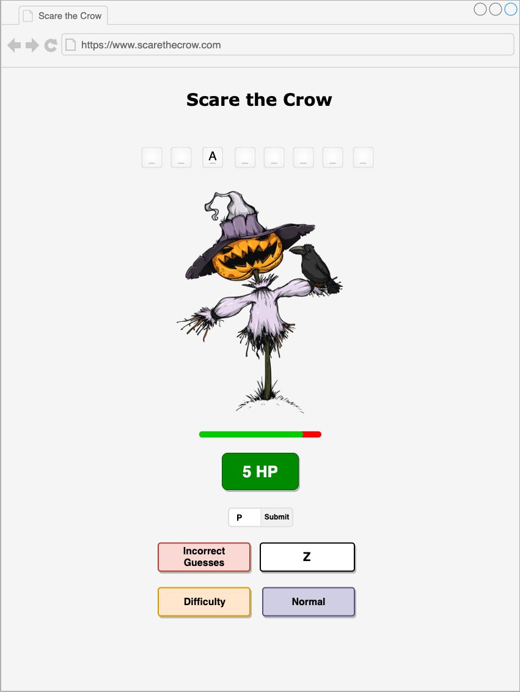

# Scare the Crow

Scare the Crow is my implementation of the classic word game, Hangman. Halloween is right around the corner so I wanted to combine that theme with the story of how, at one point in my life, a crow in my neighborhood used to dive-bomb me for no apparent reason!

The objective of this game is to guess the randomly picked secret word using 6 or less guesses. The user plays the role of a scarecrow with 6 HP (hit points or health points). Each time the player guesses incorrectly, the crow dive-bombs the scarecrow, dealing damage equivalent to 1 HP. If the user guesses the secret word correctly, with HP remaining, the scarecrow successfully scares the crow away! If not, the crow defeats the scarecrow!

# Wireframe

# M.V.P. - Minimum Viable Product

- Display the length of the secret word
- Correct guesses will show all occurrences of that letter
- Incorrect guesses will decrement the number of guesses by 1
- Display the number of guesses remaining
- Display a list of incorrect guesses
- Retrieve a list of words from the word dictionary REST API
- App is hosted online
- Responsive design

# Additional features (for consideration)

- 'New Game' option
- Additional options for difficulty:
  - Countdown timer, for example:
    - 3 seconds to pick a letter
    - 10 seconds to reveal the secret word
  - Choose difficulty:
    - Easy - 8 HP
    - Normal - 6 HP
    - Hard - 4 HP
    - Helloween - 3 HP
  - Use API parameters to choose more difficult words
- Scoring system
  - 3 lives, 6 HP each
  - Points scale based on number of guesses or time remaining
- Option to guess the secret word instead of one letter at a time
- Scarecrow diagram
  - Opposite of Hangman: Scarecrow diagram appears at start of game and loses a body part every time it takes damage
